# Práctica 6.1 - Dockerización del Despliegue de una Aplicación con Node.js

## Despliegue con Docker
Para comenzar esta práctica, se deberá clonar el siguiente repositorio de GitHub:
`https://github.com/raul-profesor/DAW_practica_6.1_2024.git`

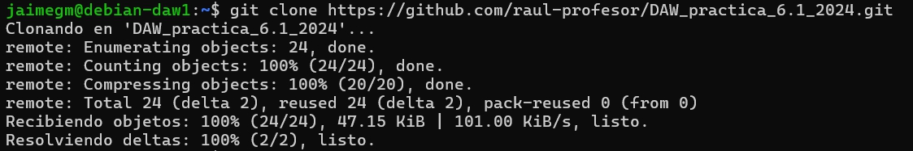

Antes de seguir adelante, se deberá tener instalado Docker en el sistema. 
Para ello, se deberá ejecutar el siguiente comando:

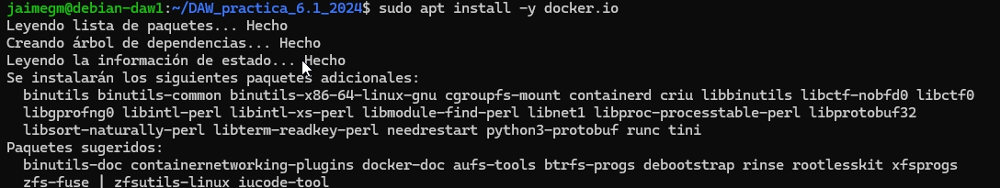

Una vez instalado Docker, se deberá modificar el archivo `Dockerfile` del repositorio clonado
previamente pra construir la imagen y hacer funcionar el contenedor.

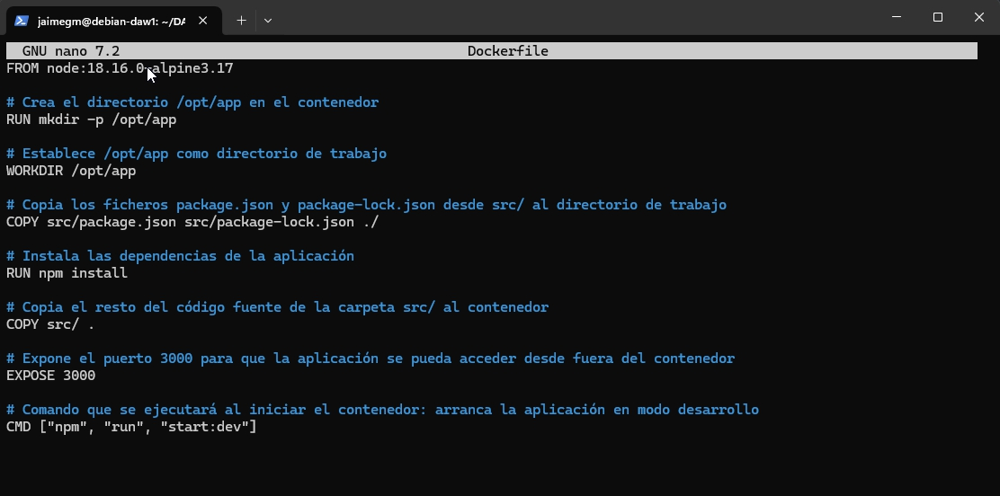

Ahora se deberá construir la imagen `librodirecciones` utilizando el contexto actual. 
Para ello, se deberá ejecutar el siguiente comando:

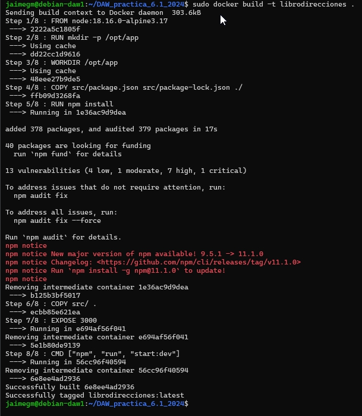

Se proderá ahora a iniciar el contenedor en modo demonio y hacer que escuche las peticiones en el puerto 3000
y se hará coincidir el puerto 3000 del contendor.

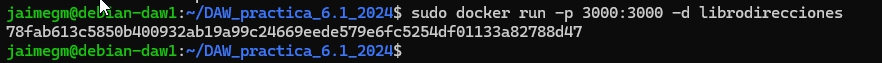

Si se prueba, deberá aparecer la siguiente pantalla:

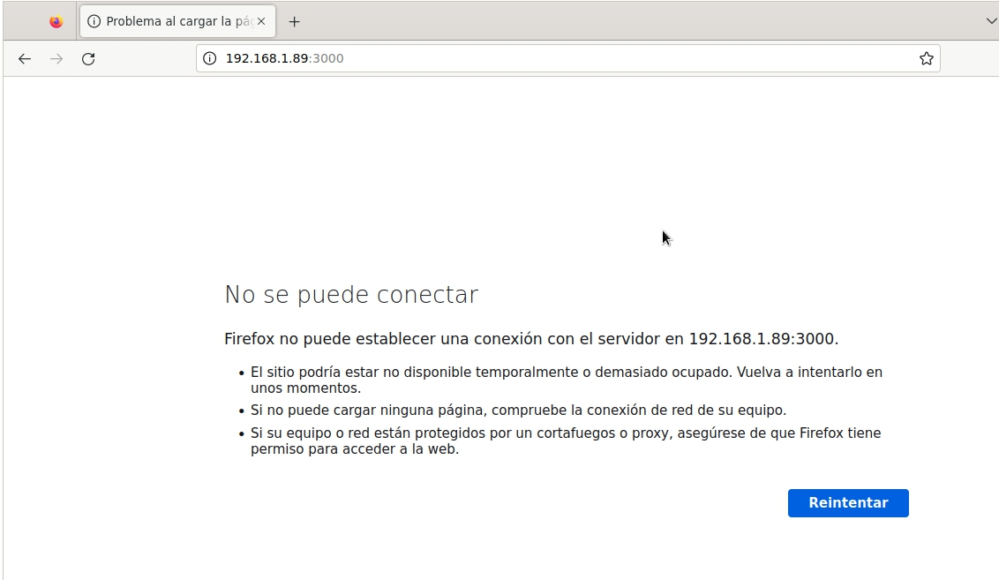

La aplicación intenta conectarse a la base de datos en localhost pero la base de datos aún no está configurada 
en otro contenedor.

## Docker Compose
Antes de seguir adelante, se deberá tener instalado Docker Compose en el sistema.
Para ello, se deberá ejecutar el siguiente comando:

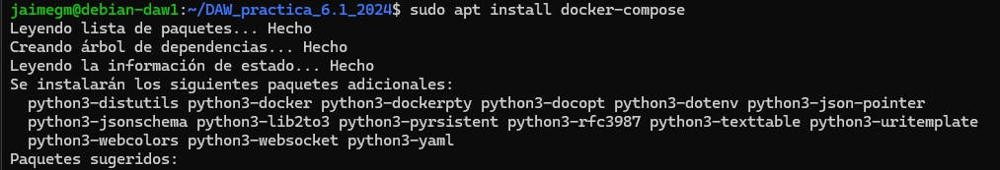

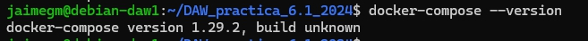

Se deberá crear un archivo `docker-compose.yml` en el directorio raíz del repositorio 
clonado con el siguiente contenido:

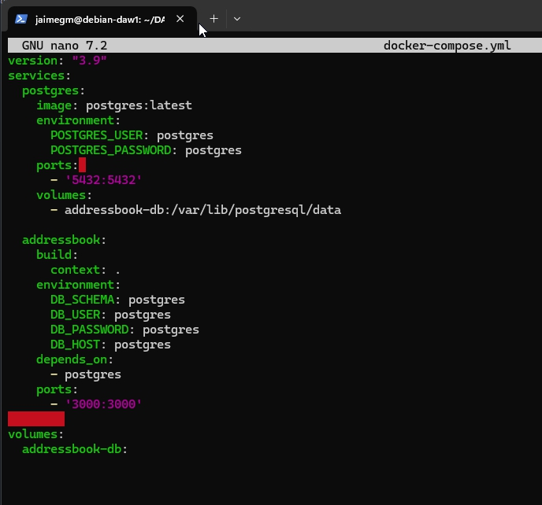

La sección ``postgres`` define el contenedor de la base de datos, expone el puerto 5432 y monta un volumen para la persistencia de datos.

La sección ``addressbook`` se encarga de construir la imagen de la aplicación (usando el Dockerfile) y define variables de entorno 
para conectarse a la base de datos. La variable ``DB_HOST`` se establece a ``postgres``, que es el nombre del servicio de la base de datos.

La directiva ``depends_on`` asegura que el contenedor de la base de datos se inicie antes que el de la aplicación.

Antes de iniciar los contenedores, se debe crear la estructura de la base de datos 
(tablas, etc.). Para ello, se ejecutará:

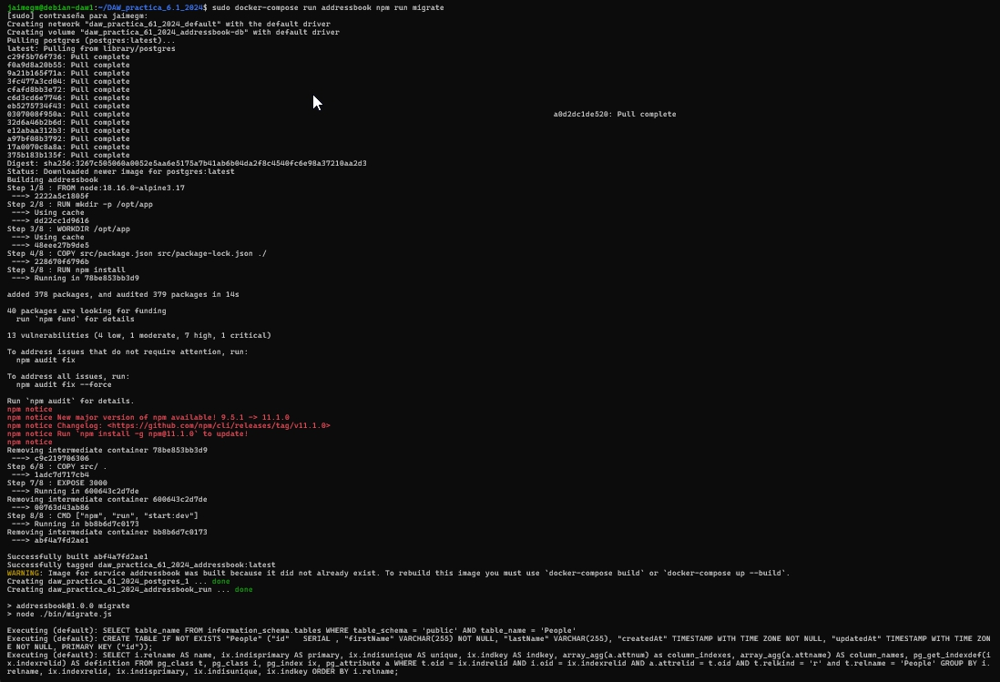

Se deberá iniciar los contenedores con el siguiente comando:

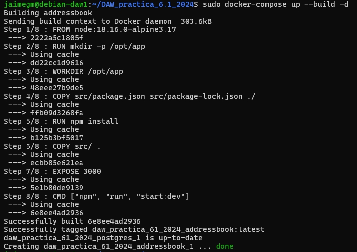

Si se ejecuta el comando `docker compose run addressbook npm test`, se deberá ver la siguiente salida:

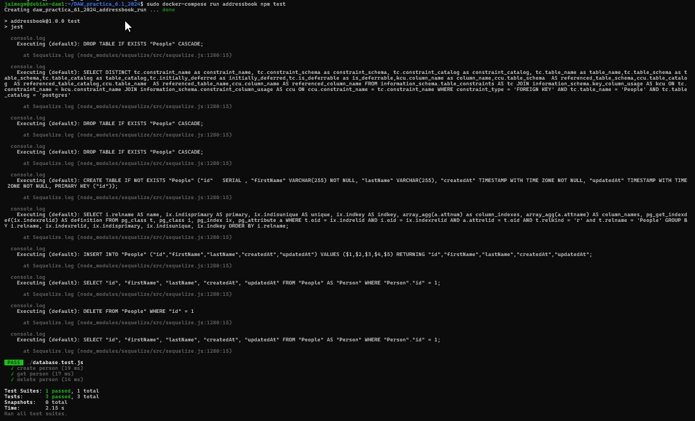

## Tarea

Se deberá probar la aplicación con la BBDD y una API:

- Añade una persona: `curl -X PUT http://localhost:3000/persons -H 'Content-Type: application/json' -d '{"id": 1, "firstName": "Raúl", "lastName": "Profesor"}'` 

- Listar todas las personas: `curl -X GET http://localhost:3000/persons/all -H 'Content-Type: application/json'`

- Buscar una persona por ID: `curl -X GET http://localhost:3000/persons/1 -H 'Content-Type: application/json'`

- Eliminar una persona: `curl -X DELETE http://localhost:3000/persons/1 -H 'Content-Type: application/json'`

Si todo funciona bien, se deberán ver las siguientes salidas:

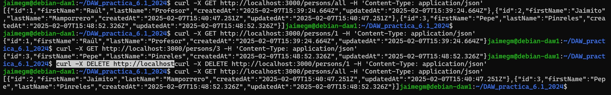

<!-- JAIME GRUESO MARTIN -->

