# Práctica 6.2 - Despliegue de una aplicación PHP con Nginx y MySQL usando Docker y Docker-Compose

## Proceso de dockerización de Nginx+PHP+MySQL

Primeramente hay que conectarse mediante SSH a nuestra máquina virtual.

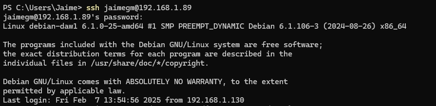

### 1. Estructura de Directorios

Para comenzar esta práctica, se deberá tener una estructura de directorios similar a la siguiente:

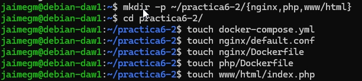

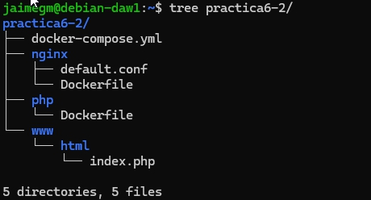

### 2.  Creación de un Contenedor Nginx

Se deberá crear un contenedor Nginx y hacerlo funcionar para que permita alojar la aplicación PHP.

Para ello, primero, se deberá editar el archivo `docker-compose.yml` con el siguiente contenido:

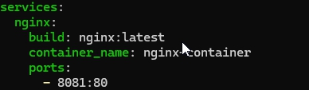

Y se iniciará el contenedor Nginx y se comprobará que funciona correctamente.

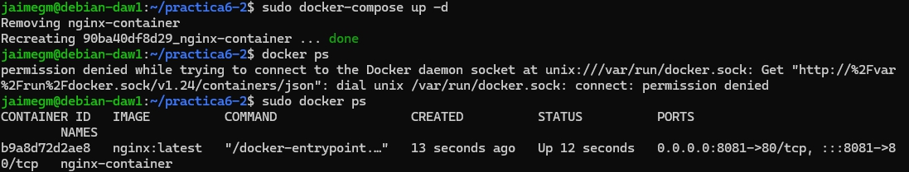

El archivo que se ha creado será el encargado de descargarse la última versión de la imagen de Nginx, crear un contenedor con ella y mapear el puerto 80 del contenedor al puerto 8081 del host.

Si accedemos a la dirección `http://localhost:8081` deberá aparecer la siguiente pantalla:

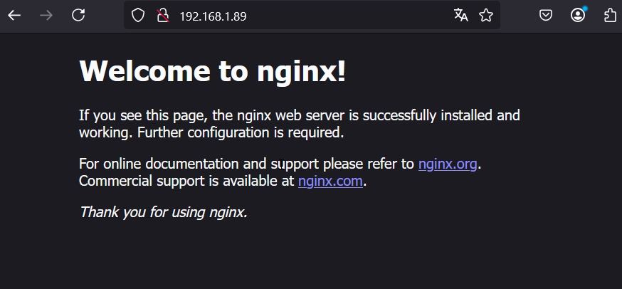

### 3. Creación de un Contenedor PHP

Editaremos el archivo `index.php` con el siguiente contenido:

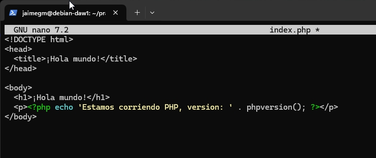

Hecho esto se creará el archivo de configuración `default.conf` en la carpeta `nginx` con el siguiente contenido:

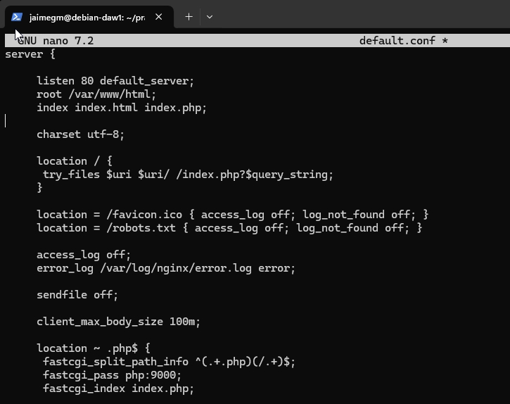

Y se modificará el archivo `Dockerfile` dentro del directorio `nginx` con el siguiente contenido:

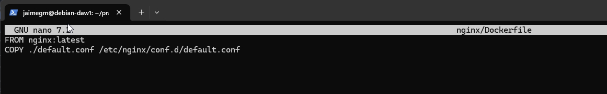

Se deberá modificar el archivo `docker-compose.yml` con el siguiente contenido:

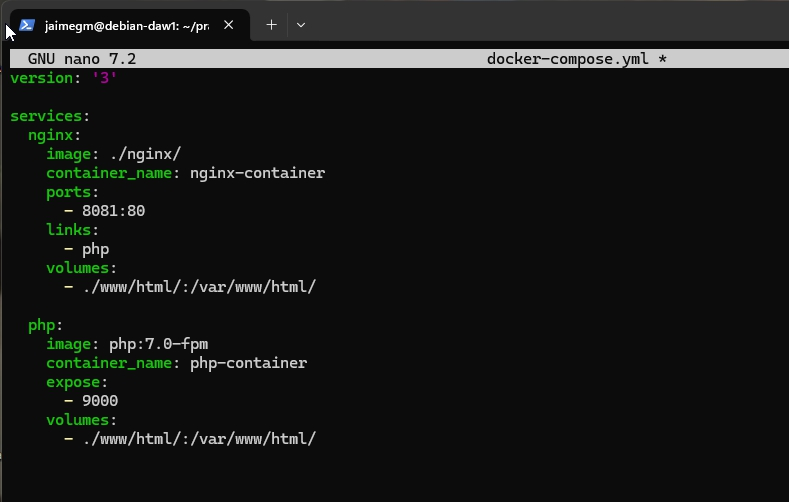

Con el fichero `docker-compose.yml` modificado, se creará un contenedor PHP en el puerto 9000 y enlazado con el contenedor Nginx.

Ahora levntaremos los contenedores y comprobaremos que funcionan correctamente.

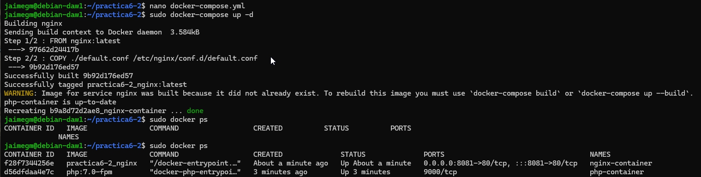

Si accedemos a la dirección `http://localhost:8081` deberá aparecer la siguiente pantalla:

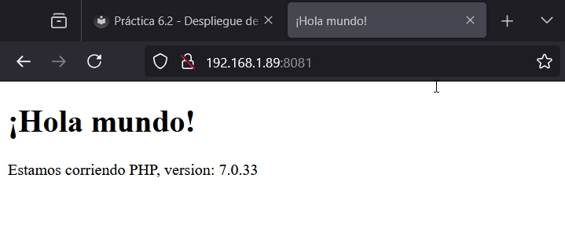

### 4. Creación de un Contenedor para Datos

Se deberá crear un contenedor para almacenar los datos. Para ello, se deberá modificar el archivo `docker-compose.yml` con el siguiente contenido:

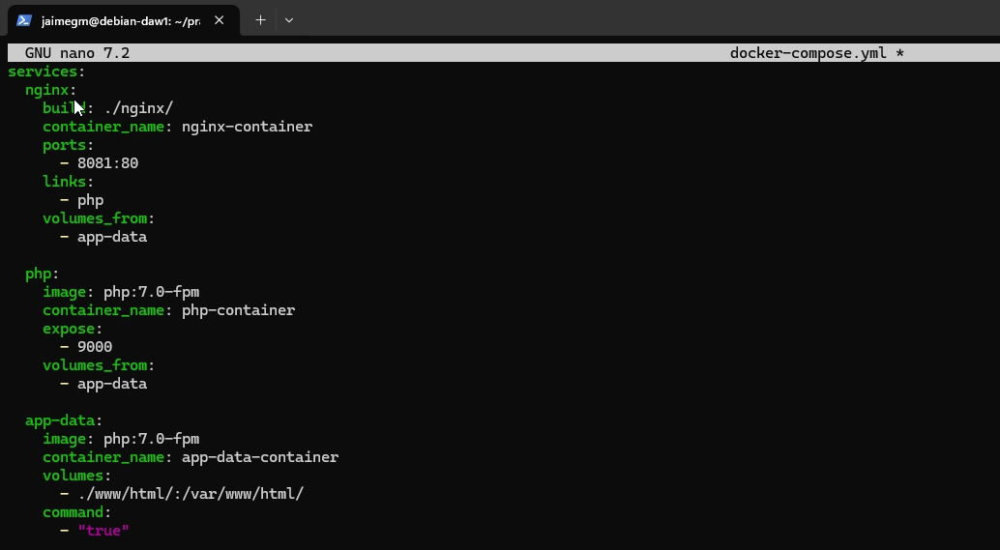

Comprobaremos que el contenedor de datos funciona correctamente.

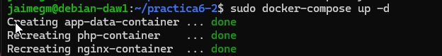

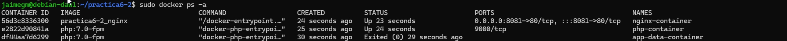


### 5. Creación de un Contenedor MySQL

Se deberá crear un contenedor MySQL y hacerlo funcionar para que permita alojar la base de datos de la aplicación PHP.

Para ello, se deberá modificar el archivo `Dockerfile` del directorio `php` con el siguiente contenido:

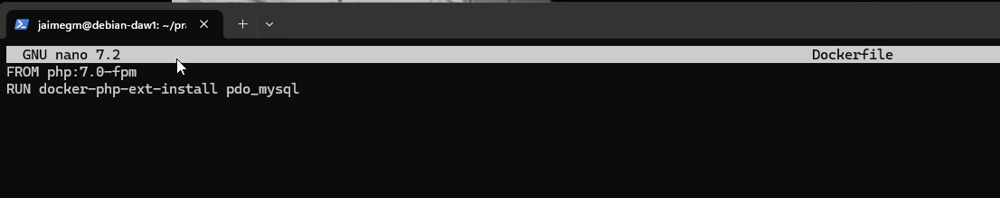

Se deberá modificar el archivo `docker-compose.yml` con el siguiente contenido:

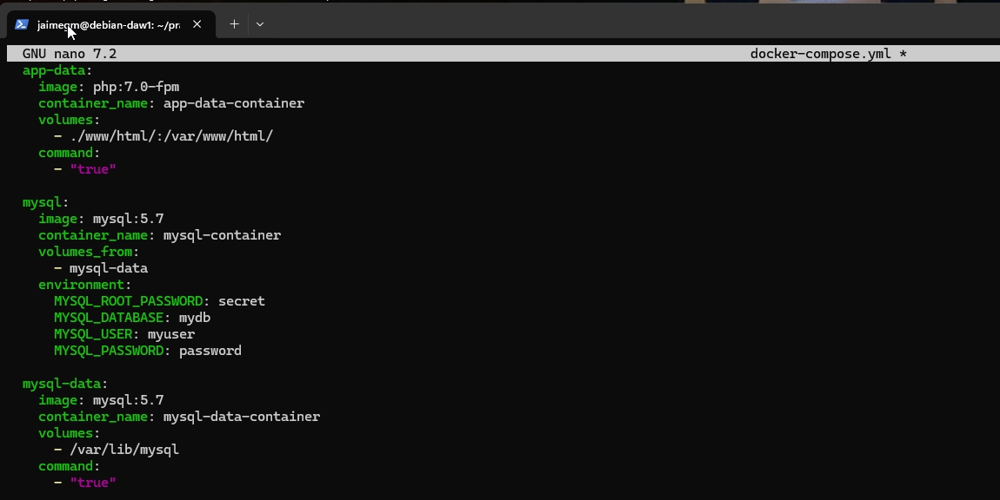

Se deberá modificar el archivo `index.php` con el siguiente contenido:

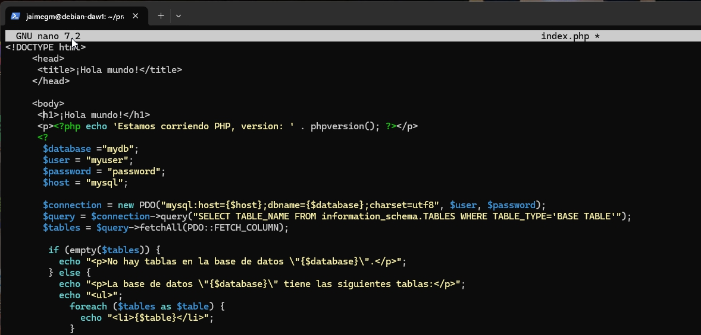

Se comprueba que el contenedor MySQL funciona correctamente.

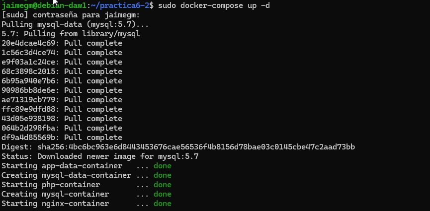

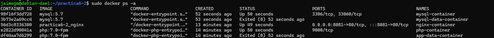

### 6. Verificación de Conexión a la Base de Datos

Si se accede a la dirección `http://localhost:8081` deberá aparecer la siguiente pantalla:

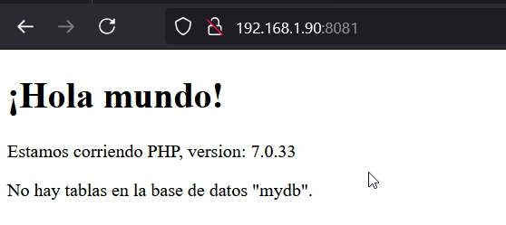

Pero si se modifica el archivo `index.php` con el siguiente contenido:

```php	
    $user = 'root';
    $password = 'secret';
```

Y deberá quedar de la siguiente manera:

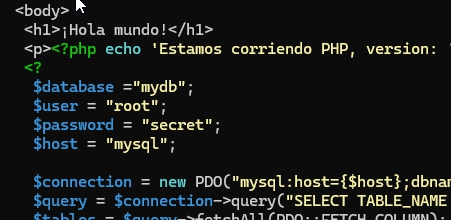

Si se accede a la dirección `http://localhost:8081` deberá aparecer la siguiente pantalla:

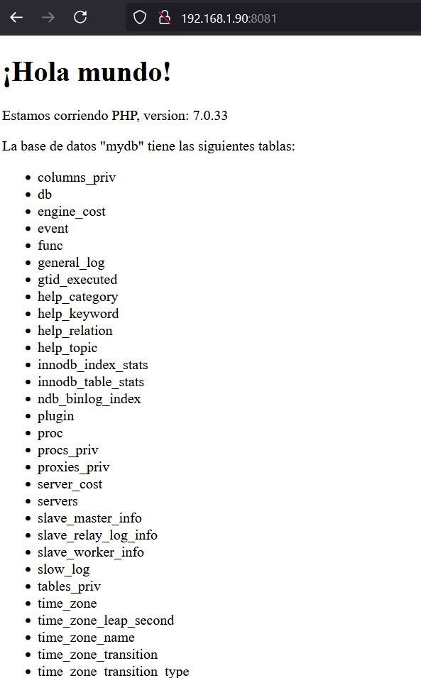

Con esto se comprueba que la aplicación PHP se conecta correctamente a la base de datos MySQL.

Y con esto se finaliza la práctica.

### 7. Esquema de la Aplicación

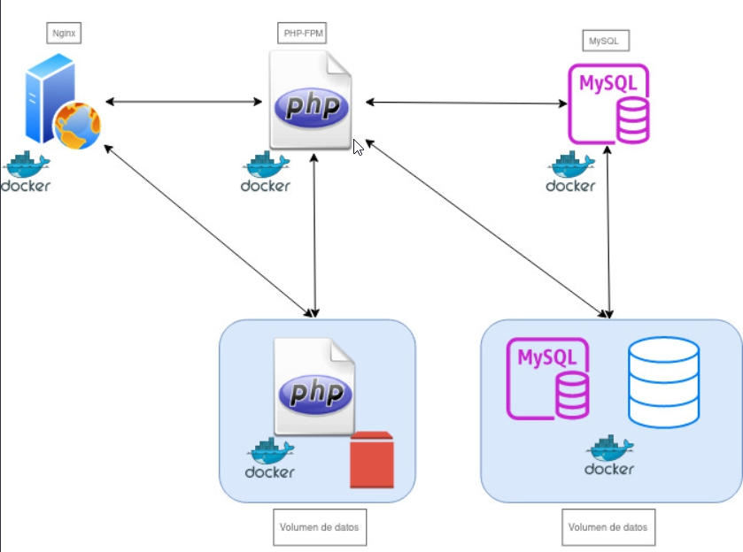

