# Práctica 6.3 - Despliegue de servidores web con usuarios autenticados mediante LDAP usando Docker y docker-compose

## Despliegue con Docker de NGINX + demonio de autenticación LDAP + OpenLDAP
Primeramente hay que conectarse mediante SSH a nuestra máquina virtual.

Luego, se deberá crear una estructura de directorios similar a la siguiente:

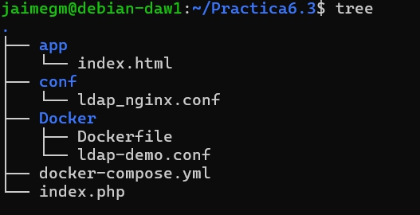

DEntro del directorio `app` se deberá crear un archivo `index.html` con el siguiente contenido:

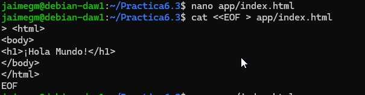

Ahora se creará otro directorio llamado `conf` y dentro de él se creará un archivo `ldap_nginx.conf` con el siguiente contenido:

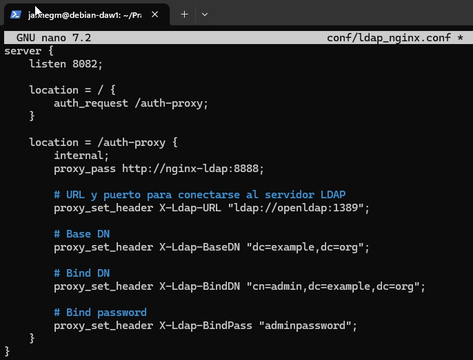

En la configuración anterior se ha establecido que Nginx escuche en el puerto 8082 (el 8080 está ocupado) para las peticiones HTTP. Además, se ha configurado una autenticación para el directorio /auth-proxy, especificando la URL del servidor OpenLDAP (usando el nombre del contenedor Docker), el DN base para las búsquedas y las credenciales de acceso para realizar las consultas. 

Hecho esto, se creará un archivo `docker-compose.yml` con el siguiente contenido:

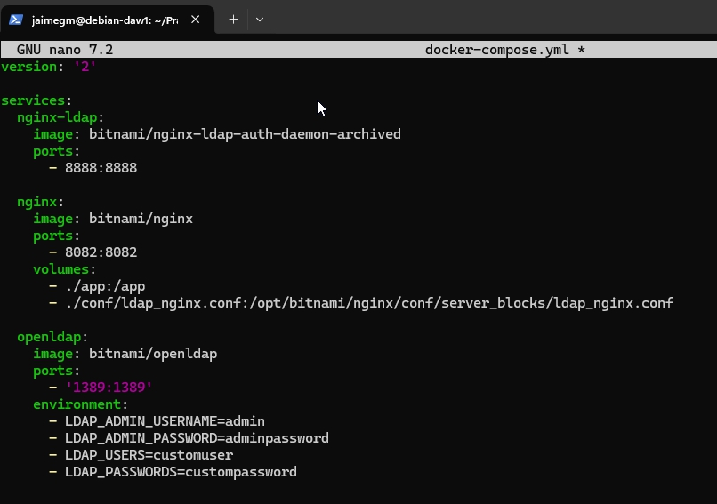

Con el archivo `docker-compose.yml` creado, se levantarán los contenedores y se comprobará que funcionan correctamente.

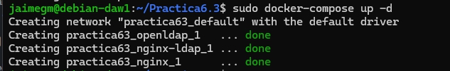

Si accedemos a la dirección `http://tu-ip:8082` deberá aparecer la siguiente pantalla:

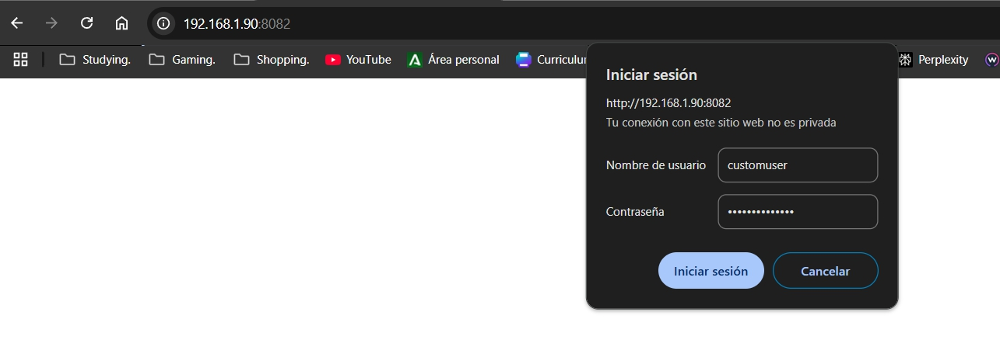

Introdcimos las credenciales de acceso y deberíamos poder acceder a la página principal.

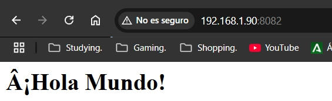

## Despliegue con Docker de PHP + Apache con autenticación LDAP

Haciendo uso de la anterior estructura de directorios, se creará un archivo `index.php` con el siguiente contenido:

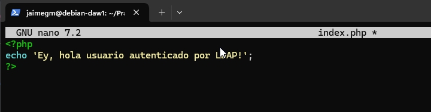

En el directorio `Docker` se creará un archivo `Dockerfile` con el siguiente contenido:

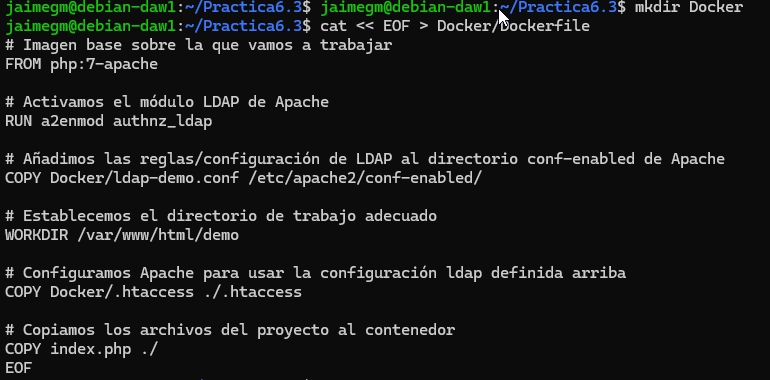

Se creará un archivo en el directorio `Docker` llamado `ldap-demo.conf` con el siguiente contenido:

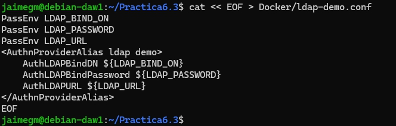

Se creará en el mismo directorio un archivo `.htaccess` con el siguiente contenido:

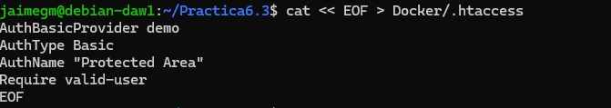

Hecho esto y comprobado que todo esté correcto, se ejecutará el siguiente comando par construir la imagen:

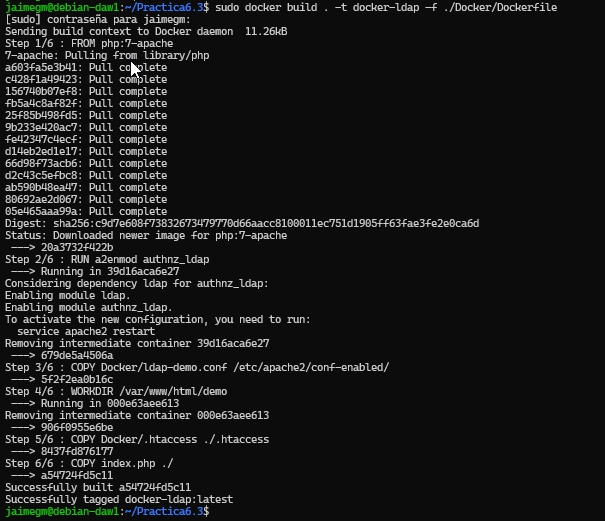

Si todo ha ido bien, se ejecutará el siguiente comando para levantar el contenedor:

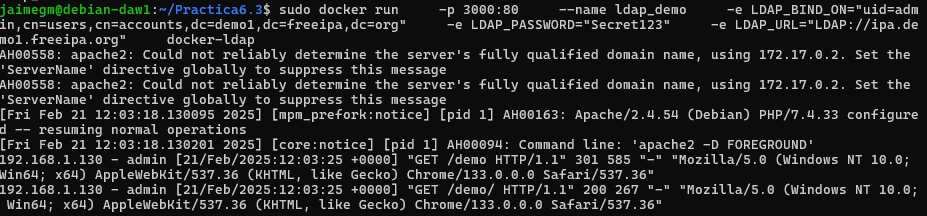

Si accedemos a la dirección `http://tu-ip:3000/demo` y nos logueamos con las credenciales de acceso `admin` y `Secret123`, deberá aparecer la siguiente pantalla:

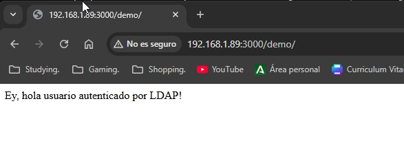

Con esto, se da por finalizada la práctica.